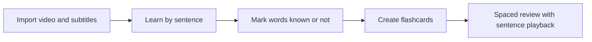

# Quick Start

Prism English is not another isolated vocabulary app. It starts from **shows and videos you already watch and care about**: subtitles are the textbook, video is the context, and every “know / don’t know” choice is real learning.

## Install (Desktop)

1. Go to the [Download](/en/download) page for Windows or macOS installers (links available when released).
2. Install and launch the app.
3. On the welcome screen, choose your **target language** (e.g. English).

::: warning
Use only official installers. You are responsible for the copyright of video files you import; Prism English only helps you learn from subtitles you already have.
:::

## Five-Minute Overview

| Step | What happens |
|------|----------------|
| 1. Import | Add local video; load embedded or external subtitles |
| 2. Learn | Progress line by line; watch the clip and grasp meaning |
| 3. Words | Split the sentence into words; mark known / unknown |
| 4. Cards | Unknown words enter your deck and review queue |
| 5. Review | Spaced repetition; replay original sentences |

Details:

- [Import Video & Subtitles](/en/guide/import-media)
- [Learning Session](/en/guide/learning-session)
- [Review & Sentence Playback](/en/guide/review)

## Tips for Your First Session

- Pick an episode you **have already seen** so plot context lowers cognitive load.
- Aim for **10–20 sentences** per session—quality over quantity.
- Review new unknown words the next day.

For the learning philosophy behind the app, see [Why Learn This Way](/en/about/why-learn-this-way).
